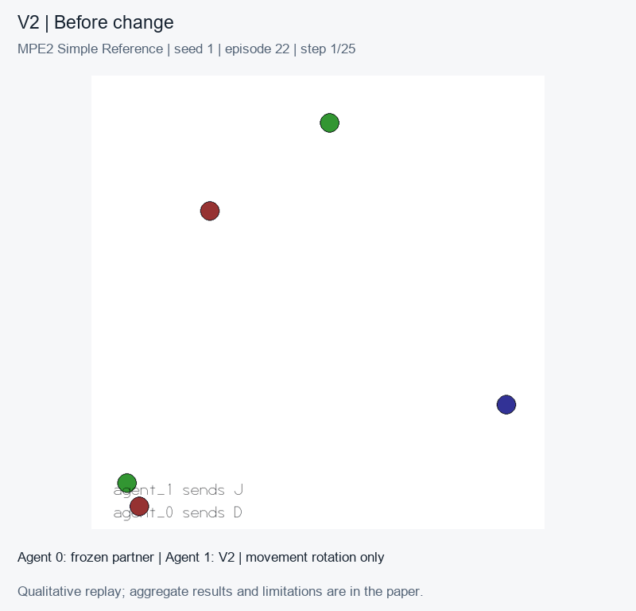

# Selective adaptation in cooperative multi-agent learning

**[Read the paper](https://Victor-Caus.github.io/selective-marl-adaptation/paper.pdf)** · [Project page](https://Victor-Caus.github.io/selective-marl-adaptation/) · [LaTeX source](paper/manuscript-v0.2.tex) · [Evaluation data](paper/data/liam-three-seeds)

What should an agent change when cooperation breaks down: how it interprets a message, or how it executes a movement?

This project studies that question in MPE2 **Simple Reference**, a two-agent communication task. We perturb received symbols, movement commands, both interfaces, or neither. V2 wraps a frozen recurrent MAPPO policy with a learned message translator and an online motor correction. A gate decides when to enable message correction and withdraws it if returns deteriorate.

## Results

The LIAM comparison contains three completed training seeds, seven methods and four conditions, with 20 sessions of 60 episodes per combination. Only agent 1 adapts; its partner remains frozen. LIAM uses its official core with an environment/dimension port, not a reproduction of the original paper's benchmark scores.

| Method | No change | Message permutation | Movement rotation | Both |
| --- | ---: | ---: | ---: | ---: |
| Frozen policy | −8.11 | −19.49 | −22.57 | −28.17 |
| Motor correction only | −8.11 | −19.49 | −9.01 | −20.17 |
| Unguarded V2 | −8.15 | −18.11 | −9.07 | −18.87 |
| Selective V2 | −8.11 | −18.50 | −9.01 | −19.13 |
| LIAM, 40M steps | −15.52 | −19.40 | −16.08 | −19.46 |

Mean post-change team return; higher is better. The paper includes all seven methods, seed-level results and uncertainty.

Motor correction recovers much of the frozen policy's performance. Selective message correction does not consistently beat simpler correction rules. Although V2 has higher aggregate returns than LIAM, LIAM wins the message-only and combined conditions in two of the three seeds. Its third seed performs poorly even before the change. All exploratory paired 95% intervals include zero.

The planned five-seed LIAM criterion was not evaluated after the study closed with three seeds. A separate five-seed campaign with two adaptive agents failed its selectivity-superiority criterion. These campaigns are reported separately. This is a working research manuscript, not a peer-reviewed result or a claim of general superiority.

## Demonstration



A qualitative replay from a trained checkpoint. [Replay metadata](site/assets/replay.json) records the checkpoint hashes, scenario and episode selection. The demonstration is separate from aggregate evidence; the environment has continuous rewards rather than a binary success flag.

## Environment and methods

| Condition | Received messages | Agent 1 movement commands |
| --- | --- | --- |
| `none` | unchanged | unchanged |
| `semantic` | fixed symbol permutation at both receivers | unchanged |
| `behavioral` | unchanged | fixed clockwise rotation |
| `both` | symbol permutation at both receivers | clockwise rotation |

`behavioral` is the historical code label for an actuator perturbation, not a change in the partner's strategy. The agent is not given the intervention label, permutation or change point.

The current V2 implementation is in [adapters_v2.py](src/selective_marl/adapters_v2.py). Its receiver GRU has its own weights; motor correction uses local system identification. Two passes through the same frozen base actor produce movements from corrected observations and outgoing messages from raw observations. [Architecture](docs/architecture.md) explains this separation.

## Installation

```bash
python -m venv .venv
source .venv/bin/activate
python -m pip install -e ".[dev,analysis]"
pytest
selective-marl-smoke --episodes 5 --seed 42
```

On Windows, activate with `.venv\Scripts\Activate.ps1`. Smoke tests check execution, not scientific performance. Reference-backed experiments additionally require the pinned MAPPO and LIAM sources described in [reproductions](reproductions/references.lock.json) and the [runbook](docs/runbook.md).

## Reproducing the study

- [LIAM protocol](docs/liam-comparison-protocol.md): checkpoints, budgets, pairing and original primary criterion.
- [Simpler-control protocol](docs/selectivity-comparison-protocol.md): the separate five-seed campaign.
- [Raw evaluations and audit](paper/data/liam-three-seeds): 1,680 sessions and 100,800 episode records.
- [Paper source and publication build](paper/README.md): figures, bibliography and automated PDF publication.

Large checkpoints and machine-specific logs are excluded from Git. Earlier in-house algorithms remain available for provenance and engineering tests; they are distinct from the reference-backed methods in the paper.

## Relation to the PSC

This study explores the kind of experiment we want to support with the PSC game-environment engine: construct a cooperative task, change one interface, and inspect how agents recover. The reported experiments run in MPE2. The proposed Relay Workshop game and MARL extensions to the PSC engine are future work, described in the paper's appendix.

## Credits

- **Environment:** [Farama Foundation MPE2](https://mpe2.farama.org/environments/simple_reference/), continuing the Multi-Agent Particle Environments associated with Lowe et al. and Mordatch & Abbeel.
- **Base policy:** [MAPPO](https://github.com/marlbenchmark/on-policy), Chao Yu, Akash Velu, Eugene Vinitsky, Jiaxuan Gao, Yu Wang, Alexandre Bayen and Yi Wu.
- **Comparator:** [LIAM](https://github.com/uoe-agents/LIAM), Georgios Papoudakis, Filippos Christianos and Stefano V. Albrecht.

Our work concerns the intervention harness, adapter composition and evaluation. External algorithms and the particle simulator retain their original authorship and licenses. See [references](paper/references.bib) and [source revisions](reproductions/references.lock.json).

## License

Project code is MIT licensed. External implementations and environment assets retain their respective licenses. The paper is distributed as a working manuscript for review.
